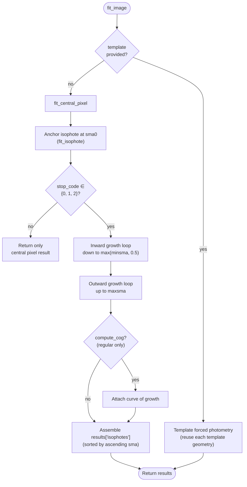
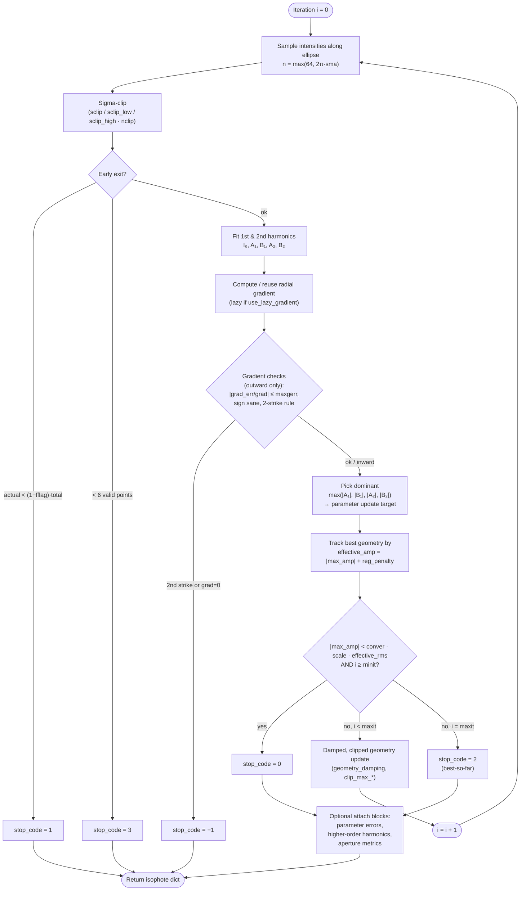
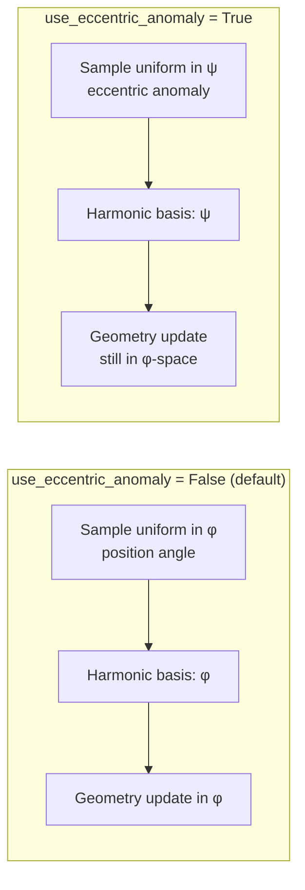
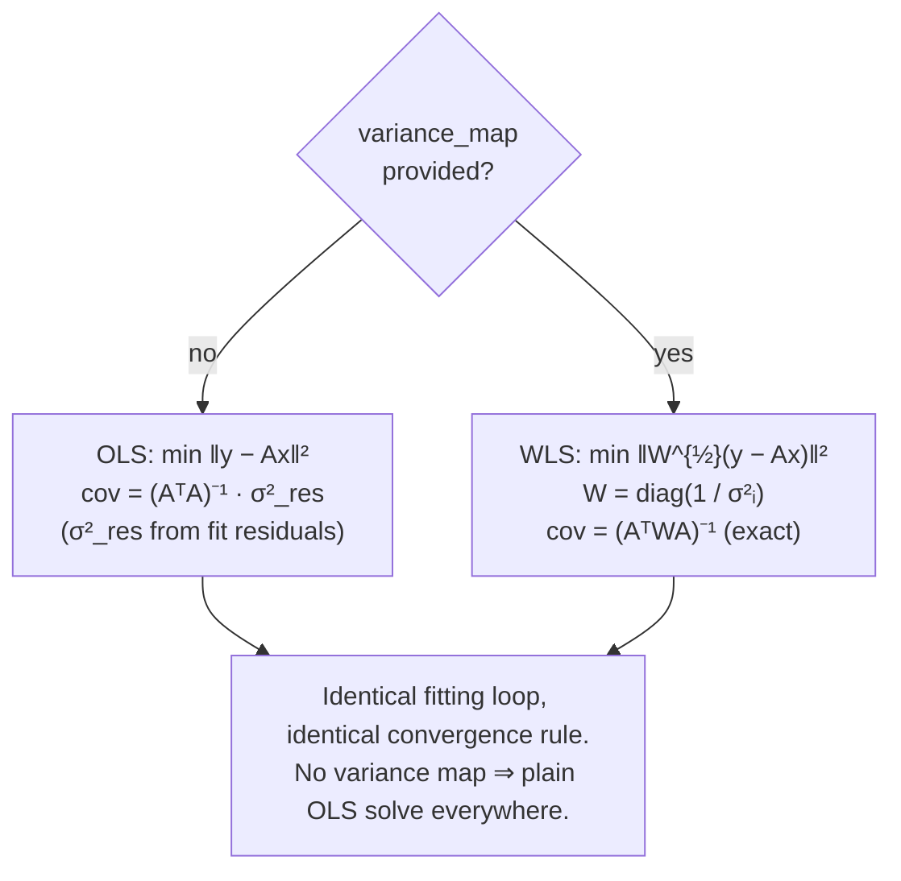
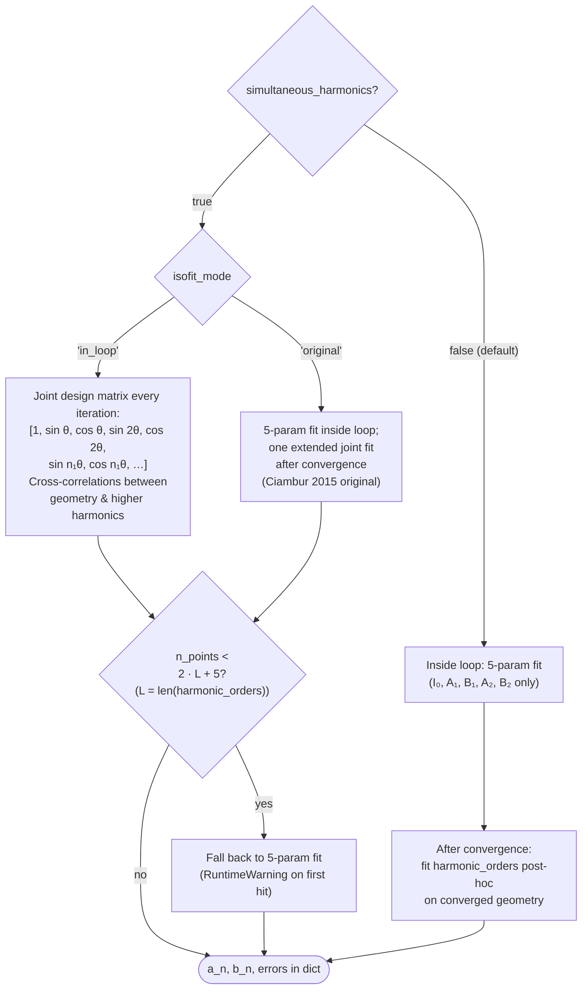
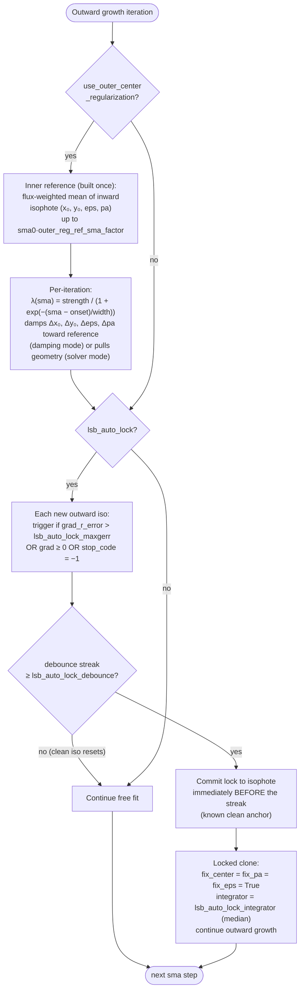

# Algorithm walkthrough

How a single call to `fit_image` turns a 2-D galaxy image into a
list of fitted elliptical isophotes. This page is a *visual*
companion to the technical chapter — it summarizes the pipeline,
the per-isophote loop, and the major branches through Mermaid
flowcharts. The accompanying prose discussion lives in the
[technical chapter](../technical/1.0-overview.md).

## 1. Image-level pipeline

Regular mode of `fit_image` (`isoster/driver.py`) is a single
linear pipeline. There is exactly one mode switch at the top: if a
`template` is supplied, the call dispatches to template-based
forced photometry; otherwise the iterative pipeline runs.

*Figure 1 — Image-level pipeline. `template` takes priority over
regular mode; the inward loop unconditionally runs before the
outward loop so that outer-region regularization can build an inner
reference; the result list is always assembled in ascending-SMA
order.*

!!! note "Inward-first execution order"
    The inward loop runs before the outward loop in *every*
    regular-mode fit, not just when outer-region regularization is
    enabled. This is a precondition for that feature but is always
    active. Consumers that iterate `results['isophotes']` by index
    are unaffected because the list is still assembled in
    SMA-sorted order.

### Mode-selection priority

| Trigger | Mode | Driver function |
|---|---|---|
| `template` argument supplied | Template-based forced photometry | `_fit_image_template_forced` |
| Otherwise | Regular iterative fitting | inline in `fit_image` |

`template` accepts a results dict, a FITS path, or a list of
isophote dicts. `template_isophotes` is still accepted as a
deprecated alias.

## 2. Per-isophote fit loop

Each isophote — the anchor at `sma0` and every step of the inward
and outward loops — is fitted by `fit_isophote`
(`isoster/fitting.py`). The loop runs up to `maxit` iterations.
The dominant first / second harmonic amplitude is used both to
choose which geometry parameter to update and as the convergence
criterion. Convergence is declared only after at least `minit`
iterations.

*Figure 2 — Per-isophote fit loop. Stop codes carry semantics:
**0** ok, **1**–**2** caution, **3** and **−1** failure. See
[Section 8](#8-stop-codes) for the full table.*

!!! info "Convergence with a noise floor"
    When `sigma_bg` is provided,
    `effective_rms = max(rms, sigma_bg / √N)` with `N` the number of
    surviving samples after masking and sigma clipping. This stops
    the solver
    from chasing noise-induced asymmetries in LSB regions where
    `rms` can dip below the photon-noise limit.

!!! info "Convergence scale factor"
    `scale` in the convergence test is an SMA-dependent factor set
    by `convergence_scaling`. The default `'sector_area'` uses
    `scale = max(1, sma · Δsma · Δθ)` with `Δsma` the SMA step and
    `Δθ = 2π/N` the angular sample spacing, so the threshold scales
    roughly with the area of one sample sector; `'sqrt_sma'` uses
    `max(1, √sma)` and `'none'` uses `1`.

!!! info "Lazy gradient"
    By default the radial gradient is evaluated once on iteration 0
    and reused. If the geometry stops improving for three
    consecutive iterations the gradient is re-evaluated. The
    gradient costs one extra sampling pass (a one-sided difference
    reusing the current sample), so iterations that reuse the
    cached gradient cost one sampling pass instead of two.

!!! info "Gradient-SNR damping"
    If the local gradient is noisy (SNR < 3), `geometry_damping` is
    dynamically reduced so the iteration cannot overfit the noise
    floor.

!!! info "Step clipping"
    Hard caps `clip_max_shift`, `clip_max_pa`, `clip_max_eps` bound
    the per-iteration update. This prevents runaway divergence when
    a single iteration crosses an image defect or extreme noise
    patch.

## 3. Geometry update mapping

Step 7 of the fit loop picks *one* geometry parameter to correct
per iteration (in the default `geometry_update_mode='largest'`):
the parameter whose harmonic amplitude is largest. This is the same
coordinate-descent strategy used by `photutils.isophote` and IRAF
`Ellipse` (Jedrzejewski 1987). The `'simultaneous'` mode instead
updates all four parameters every iteration and pairs naturally
with a smaller `geometry_damping`.

| argmax index | Harmonic term | Basis | Updated parameter |
|---|---|---|---|
| 0 | `A₁` | sin(θ) | Center, minor-axis component |
| 1 | `B₁` | cos(θ) | Center, major-axis component |
| 2 | `A₂` | sin(2θ) | Position angle (PA) |
| 3 | `B₂` | cos(2θ) | Ellipticity, with bounds & wrap handling |

Constraint flags (`fix_center`, `fix_pa`, `fix_eps`) zero the
corresponding harmonic terms in the dominance selection so that
constrained axes simply do not enter the argmax.

## 4. Sampling — φ vs eccentric anomaly

The ellipse is sampled by `scipy.ndimage.map_coordinates` through
`compute_ellipse_coords` at `n_samples = max(64, int(2·π·sma))`
points. There are two angular conventions for the basis of the
harmonic fit:

*Figure 3 — The two angular conventions for harmonic sampling.
Uniform-in-ψ sampling gives uniform arc-length coverage on highly
elliptical isophotes, which is the motivation for Ciambur 2015.*

!!! info "When to switch on EA mode"
    Recommended for ellipticity above ~0.3 and required for edge-on
    disks and X-shaped / peanut bulges where uniform-in-φ sampling
    under-samples along the major axis. Geometry updates are still
    computed in φ-space so that `x0`, `y0`, `eps`, `pa` retain
    their usual geometric meaning.

## 5. Solver — OLS vs WLS

ISOSTER uses a single design-matrix solver internally. The only
difference between the two paths is the inner-product matrix.

*Figure 4 — OLS / WLS branch. The WLS covariance is exact: no
residual-variance rescaling is needed.*

| Quantity | OLS | WLS |
|---|---|---|
| Normal equations | `AᵀA x = Aᵀy` | `AᵀWA x = AᵀWy` |
| Parameter covariance | `(AᵀA)⁻¹ · σ²_res` | `(AᵀWA)⁻¹` |
| Intensity error | `rms / √N` | `√[(AᵀWA)⁻¹]₀₀` (fit covariance; forced photometry uses the exact `1/√Σ σᵢ⁻²`) |
| Gradient error | scatter-based | `√(Var(mean_c) + Var(mean_g)) / Δr` with `Var(mean) = 1/Σ σᵢ⁻²` |

!!! note "What WLS buys you"
    Errors come directly from the per-pixel variance map rather
    than from fit residuals; cosmic rays and hot pixels are
    automatically down-weighted; gradient error is separated from
    galaxy-structure scatter (arms, dust, bars). WLS composes with
    all constraint and harmonic modes.

## 6. Harmonics — post-hoc vs ISOFIT

All higher-order harmonics (`a₃, b₃, a₄, b₄, …` for orders in
`harmonic_orders`, default `[3, 4]`) are available, but how they
are *computed* differs along two axes: when they are fitted, and
which design matrix is used during iteration. The two paths
converge on the same output schema.

*Figure 5 — Harmonic-fit modes. `'in_loop'` is the most aggressive
variant and produces the cleanest RMS estimate at ~25–35% extra
cost over the default post-hoc path.*

## 7. LSB outskirt strategies

Two independent features address geometry drift in the
low-surface-brightness outskirts. They are designed to compose:
**outer-region regularization** is a *soft* Tikhonov damping that
runs in every outward iteration once the SMA crosses an onset
radius; the **automatic LSB lock** is a *hard* one-way switch
that, when triggered, freezes geometry for the remainder of
outward growth.

*Figure 6 — LSB outskirt strategies. The two mechanisms are
independent and compose cleanly: soft damping pre-lock, hard
freeze post-lock.*

### Soft regularization details

- The inner reference is built from inward isophotes with
  acceptable stop codes and `sma ≤ sma0 · outer_reg_ref_sma_factor`.
  If none qualify, the reference falls back to the anchor.
- `outer_reg_mode='damping'` (default) shrinks harmonic geometry
  steps in the outer region; `'solver'` additionally pulls the
  geometry toward the reference. Both are applied in the
  geometry-update equations (after the harmonic solve), not inside
  the linear system.
- A complementary selector penalty
  (`compute_outer_center_regularization_penalty`) contributes to
  `effective_amp` so the best-iteration tracker also prefers
  regularized geometries.
- Per-axis weights `outer_reg_weights={"center", "eps", "pa"}`
  let you damp some axes and leave others free.

### Hard auto-lock details

- The detector reads `grad`, `grad_error`, and `grad_r_error` from
  each outward isophote, so `debug=True` is required and is
  silently turned on with a `UserWarning` if the caller left it
  off.
- `lsb_auto_lock_maxgerr` defaults to `0.3`, strictly more
  sensitive than `maxgerr=0.5`, so the lock commits *before* a
  gradient failure would have.
- The lock anchor is the isophote *immediately before* the trigger
  streak, not the trigger isophote itself, whose geometry may
  already have drifted.
- The transition is one-way per fit. Inward growth and the central
  pixel are unaffected.
- Auto-lock conflicts with `fix_center`, `fix_pa`, or `fix_eps` at
  validation time. With `template` mode, the feature is silently
  inactive and a warning is emitted.

!!! note "Default behaviour"
    Both features are *disabled* by default. Existing fits are
    byte-identical unless the user explicitly opts in. The soft
    feature is still under validation on a broader range of
    surveys; it is recommended for deep imaging with expected
    contamination.

## 8. Stop codes

| Code | Meaning | Trigger | Action |
|---|---|---|---|
| **0** | Success | Converged: `|max_amp| < conver · scale · effective_rms` with `i ≥ minit` | Keep |
| **1** | Too many flagged samples | `actual_points < total_points · (1 − fflag)` | Inspect mask / clipping; treat with caution |
| **2** | Max-iter fallback | Reached `maxit` without convergence; best-so-far geometry returned | Keep with caution |
| **3** | Too few points | Fewer than 6 valid samples for the harmonic fit | Discard this radius |
| **−1** | Gradient failure | Outward-only two-strike rule: gradient checks fail twice, or `grad = 0` | Treat as boundary / failure |

In regular-mode growth, codes `0`, `1`, and `2` are considered
acceptable for continued propagation (constant
`ACCEPTABLE_STOP_CODES`). Codes `3` and `−1` are unacceptable: the
failed isophote's geometry is not propagated to the next SMA step
(in the default strict mode), but growth continues to the
configured radius limit (`max(minsma, 0.5)` inward, `maxsma`
outward) — a stop code never terminates a growth loop early.

## 9. References

- Jedrzejewski, R. I. 1987, *MNRAS*, 226, 747 — original
  Fourier-harmonic ellipse-fit algorithm; the basis of all later
  Ellipse-family implementations.
- Ciambur, B. C. 2015, *ApJ*, 810, 120 — IRAF `Isofit` / `Cmodel`;
  introduces the eccentric-anomaly sampling that ISOSTER's
  `use_eccentric_anomaly` mode reproduces. arXiv:1507.02691.
- Stone, C. J., Arora, N., Courteau, S., & Cuillandre, J.-C. 2021,
  *MNRAS*, 508, 1870 — `AutoProf`; modern Python pipeline with
  ML-style fit stabilization, the most directly comparable tool to
  ISOSTER. arXiv:2106.13809.

---

*Source files referenced in this walkthrough: `isoster/driver.py`,
`isoster/fitting.py`, `isoster/sampling.py`, `isoster/config.py`.
See [the algorithmic foundation](../technical/1.1-algorithmic-foundation.md)
in the technical chapter for the prose discussion this page
summarizes visually.*
