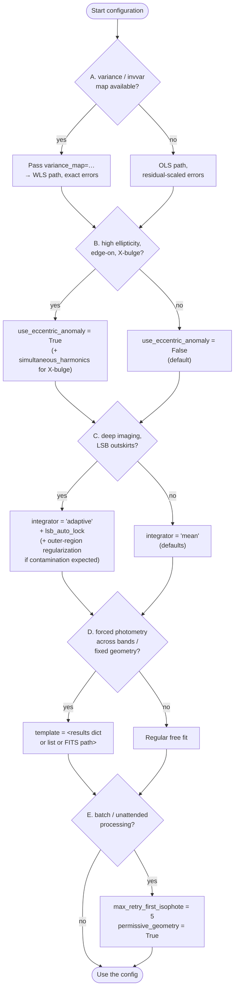
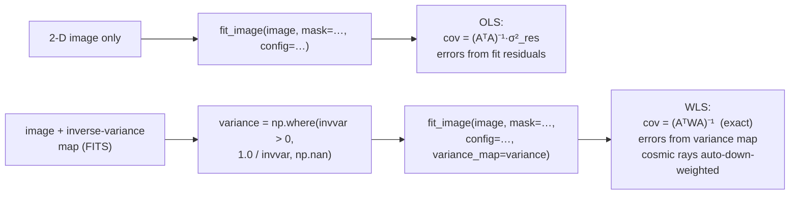
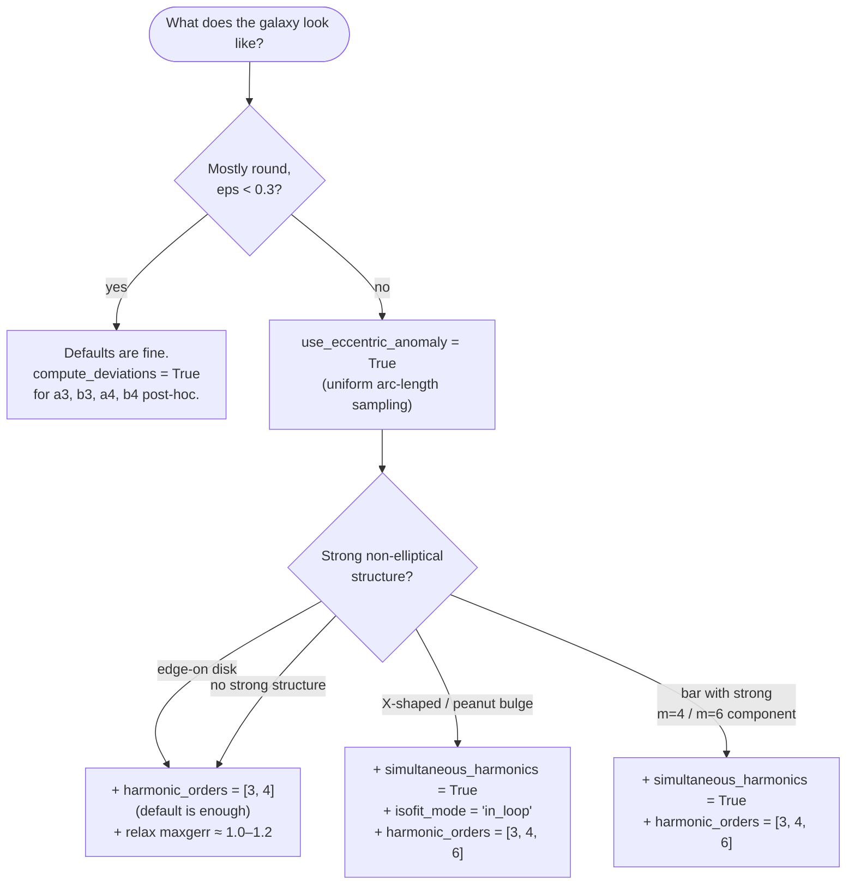
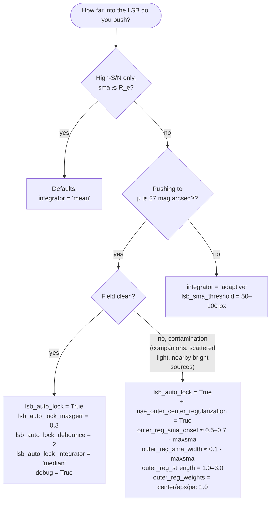
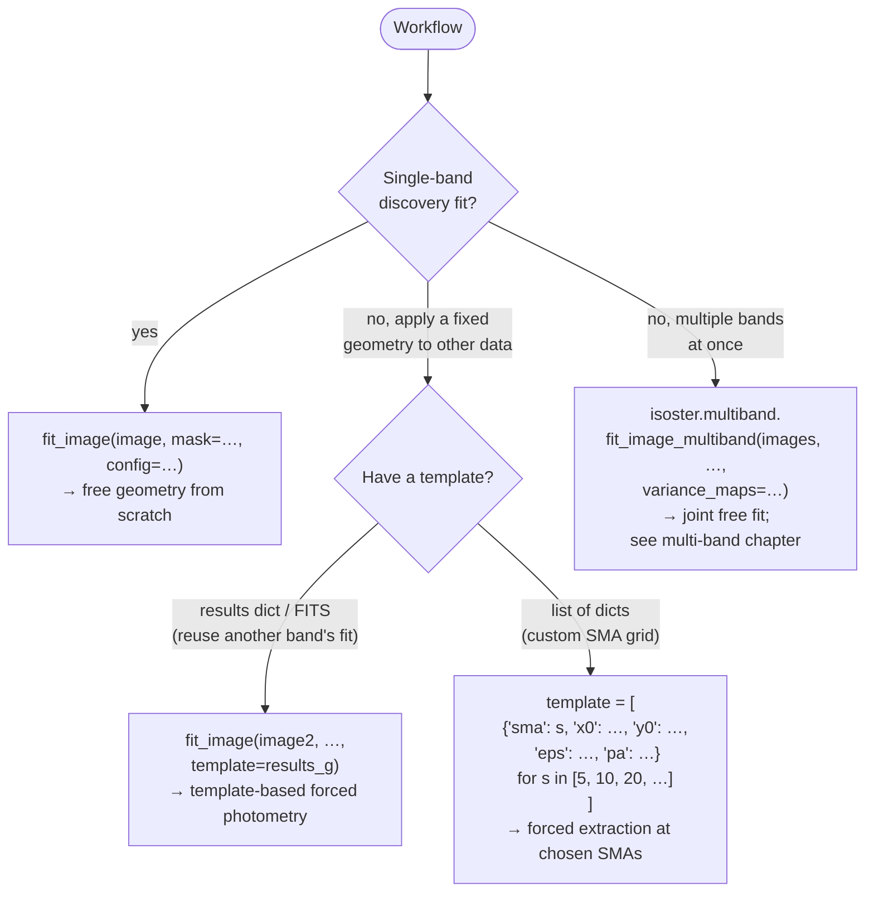

# Configuration decision tree

"What should I set?" — pick the config branch that matches your
data, your galaxy, and your science goal. Each leaf names the
specific flags involved and links into the
[technical chapter](../technical/1.0-overview.md) for the
underlying mechanism.

ISOSTER ships with sensible defaults: `IsosterConfig()` with no
arguments will fit a "typical" galaxy reasonably well. The
questions below isolate the situations where the defaults are
*not* appropriate, and tell you which flags to flip.

## 1. High-level decision flow

The five branches below are *independent*: turning on
eccentric-anomaly sampling does not preclude WLS, and the LSB lock
composes cleanly with all sampling modes. The high-level tree is
therefore a stack of yes/no questions, not a tree with mutually
exclusive leaves.



*Figure 1 — High-level decision tree. Each branch is independent;
the final config layers the answers together.*

## 2. Branch A — what data do I have?

The single biggest config decision is whether you can supply
per-pixel variances. If your survey pipeline gives you an inverse
variance map (HSC, DECaLS, SDSS, …), use it.



!!! example "If you have a variance map"
    ```python
    variance_map = np.where(invvar > 0, 1.0 / invvar, np.nan)
    results = fit_image(image, mask=mask, config=config, variance_map=variance_map)
    ```

    Leave `invvar == 0` pixels as `NaN` rather than substituting a
    large finite value like `1e30`: ISOSTER marks non-finite entries
    invalid and drops them from the fit, whereas a finite `1e30` is
    valid and stays in the ring, inflating the reported gradient
    error by orders of magnitude instead of removing the pixel.

    WLS error bars are typically 1.2–2.1× larger than OLS for outer
    isophotes — that reflects realistic per-pixel noise rather than
    fit-residual scatter. The OLS path is byte-identical when
    `variance_map=None`, so there is no downside to passing one
    when it exists. See
    [variance-aware fitting](../technical/1.4.2-variance-aware-fitting.md)
    in the technical chapter.

## 3. Branch B — what kind of galaxy?

Sampling and harmonic-fit modes depend on isophote shape. The
default (uniform-in-φ sampling with post-hoc higher harmonics) is
good for round-ish ellipticals; everything else has a recommended
upgrade.



!!! example "Default — round-ish elliptical or low-eps spiral"
    ```python
    config = IsosterConfig(
        sma0=10.0, maxsma=120.0,
        compute_deviations=True,    # a3, b3, a4, b4 post-hoc
    )
    ```

    Post-hoc higher harmonics are cheap and correct on
    low-to-moderate ellipticity.

!!! example "High ellipticity (eps > 0.3) and edge-on disks"
    ```python
    config = IsosterConfig(
        sma0=10.0, maxsma=200.0,
        use_eccentric_anomaly=True, # uniform arc-length sampling in ψ
        compute_deviations=True,
        maxgerr=1.0,                # relax for high-eps gradient noise
    )
    ```

    Uniform-in-φ sampling under-samples the major axis on highly
    elliptical isophotes. Switching to ψ-space sampling gives
    uniform arc-length coverage; geometry updates remain in
    φ-space, so the output schema is unchanged. See
    [eccentric anomaly + ISOFIT](../technical/1.4.1-eccentric-anomaly-isofit.md)
    in the technical chapter.

!!! example "X-shaped / peanut bulges (and barred galaxies with strong m=4/m=6)"
    ```python
    config = IsosterConfig(
        sma0=10.0, maxsma=200.0,
        use_eccentric_anomaly=True,
        simultaneous_harmonics=True,
        isofit_mode="in_loop",
        harmonic_orders=[3, 4, 6],
    )
    ```

    Higher-order harmonics genuinely interact with geometry on
    these galaxies. Fitting them jointly inside the iteration loop
    (true ISOFIT, Ciambur 2015) absorbs the cross-correlations and
    produces cleaner RMS estimates than the post-hoc path, at
    ~25–35% extra cost. `isofit_mode='original'` reproduces
    Ciambur's original variant (post-hoc joint solve) and is useful
    as a consistency check.

## 4. Branch C — what S/N regime am I pushing into?

In the high-S/N interior of a galaxy the defaults are robust. The
outskirts are where geometry drift, gradient failures, and
contamination become real problems. ISOSTER offers a layered set
of responses ranging from "do nothing different" to "freeze
geometry past a detected LSB transition."



*Figure 3 — LSB outskirt strategy. Soft regularization runs every
outward iteration; the auto-lock is a one-way hard switch. They
compose: soft pre-lock, hard post-lock.*

!!! example "Mid-S/N (μ ≲ 27 mag arcsec⁻²)"
    ```python
    config = IsosterConfig(
        sma0=10.0, maxsma=200.0,
        integrator="adaptive",
        lsb_sma_threshold=80.0,     # switch to median past this SMA
    )
    ```

    Median is more robust against the asymmetric tails of the
    intensity distribution in the LSB regime, but loses some
    information in the interior. Adaptive mode keeps the
    harmonic-fit mean inside and the robust median outside the
    threshold.

!!! example "Deep, clean field — hard auto-lock"
    ```python
    config = IsosterConfig(
        sma0=10.0, maxsma=300.0,
        integrator="adaptive",
        lsb_sma_threshold=100.0,
        lsb_auto_lock=True,
        lsb_auto_lock_maxgerr=0.3,
        lsb_auto_lock_debounce=2,
        lsb_auto_lock_integrator="median",
        debug=True,                 # required for detector diagnostics
    )
    result = fit_image(image, mask=mask, config=config, variance_map=variance)
    print("lock committed at sma =", result["lsb_auto_lock_sma"])
    ```

    The detector freezes `x0`, `y0`, `eps`, `pa` at the last clean
    isophote before the gradient diagnostics break down, so the
    LSB tail cannot drift. The lock is one-way per fit and only
    affects outward growth. See
    [LSB outskirt strategy](../technical/1.4.3-lsb-outskirts.md)
    in the technical chapter.

!!! example "Deep, contaminated field — soft regularization + hard lock"
    ```python
    config = IsosterConfig(
        sma0=10.0, maxsma=300.0,
        integrator="adaptive",
        lsb_sma_threshold=100.0,
        # Hard lock (kicks in late)
        lsb_auto_lock=True,
        debug=True,
        # Soft pre-lock regularization
        use_outer_center_regularization=True,
        outer_reg_sma_onset=150.0,    # ~0.5 maxsma
        outer_reg_sma_width=20.0,
        outer_reg_strength=2.0,
        outer_reg_weights={"center": 1.0, "eps": 1.0, "pa": 1.0},
    )
    ```

    The soft Tikhonov damping starts gently pulling the outward
    fit toward a flux-weighted inner reference well before the
    hard lock would commit. This bounds drift caused by faint
    companions, scattered light, or nearby bright sources, without
    freezing geometry prematurely. The two features are
    independent — either can be used alone.

!!! warning "Conflict with explicit fixes"
    `lsb_auto_lock=True` raises a `ValidationError` if combined
    with `fix_center=True`, `fix_pa=True`, or `fix_eps=True` —
    those switches make the lock trivially equivalent to ordinary
    fixed-geometry fitting.

## 5. Branch D — free fit, template, or multi-band?

Three workflow patterns dominate, and ISOSTER routes them through
exactly two code paths. Multi-band is the one decision that takes
you out of `isoster.fit_image` entirely.



| Workflow | API entry point | Features that apply |
|---|---|---|
| Single-band free fit | `fit_image(image, …)` | Everything — full feature surface. |
| Template-based forced | `fit_image(image, …, template=…)` | Sampling mode, harmonic mode, WLS apply. *Auto-lock and outer-region regularization are silently inactive* (warnings emitted). |
| Multi-band joint free | `isoster.multiband.fit_image_multiband(…)` | Detailed in the [multi-band chapter](../technical/1.4.5-multiband.md). |

!!! warning "Forced-photometry caveats"
    The LSB auto-lock and outer-region regularization are wired
    only into the regular-mode driver. With `template=…` they emit
    a `UserWarning` and silently do nothing. Build the template
    geometry under a clean free fit; let the forced pass just
    extract.

## 6. Branch E — batch / robustness knobs

For unattended batch processing (a survey or mock catalogue), two
flags make the failure modes much more graceful.

!!! example "Recommended batch defaults"
    ```python
    config = IsosterConfig(
        sma0=10.0, maxsma=200.0,
        max_retry_first_isophote=5,  # retry with perturbed sma0/eps/pa
        permissive_geometry=True,    # do not poison geometry on one bad iso
        first_isophote_fail_count=3, # emit FIRST_FEW_ISOPHOTE_FAILURE after 3
    )
    ```

    `max_retry_first_isophote` retries the anchor isophote with
    perturbed starting geometry (different `sma0`, `eps`, `pa`)
    when the first fit returns an unacceptable stop code. Without
    it, a single bad anchor causes the whole fit to silently fall
    back to just the central pixel. `permissive_geometry=True`
    propagates the latest fit's geometry even on failure, so one
    bad isophote does not poison every subsequent SMA in the
    growth loop.

## 7. Suggested starting presets

Three preset combinations cover the majority of real fits. Each
one is a single `IsosterConfig(...)` call you can paste and tweak.

### Preset 1 — "Round elliptical, single band, defaults"

```python
from isoster import fit_image
from isoster.config import IsosterConfig

config = IsosterConfig(
    sma0=10.0,
    maxsma=120.0,
    compute_deviations=True,    # a3, b3, a4, b4 post-hoc
    full_photometry=True,
    compute_cog=True,
)
results = fit_image(image, mask=mask, config=config)
```

### Preset 2 — "High-ellipticity / edge-on, WLS"

```python
config = IsosterConfig(
    sma0=10.0,
    maxsma=200.0,
    use_eccentric_anomaly=True,
    maxgerr=1.0,
    integrator="adaptive",
    lsb_sma_threshold=80.0,
    compute_deviations=True,
    full_photometry=True,
)
results = fit_image(image, mask=mask, config=config,
                    variance_map=variance)
```

### Preset 3 — "Deep LSB, contaminated field, WLS"

```python
config = IsosterConfig(
    sma0=10.0,
    maxsma=300.0,
    use_eccentric_anomaly=True,
    integrator="adaptive",
    lsb_sma_threshold=100.0,
    # Hard auto-lock
    lsb_auto_lock=True,
    lsb_auto_lock_maxgerr=0.3,
    lsb_auto_lock_debounce=2,
    lsb_auto_lock_integrator="median",
    debug=True,
    # Soft pre-lock damping
    use_outer_center_regularization=True,
    outer_reg_sma_onset=150.0,
    outer_reg_sma_width=20.0,
    outer_reg_strength=2.0,
    outer_reg_weights={"center": 1.0, "eps": 1.0, "pa": 1.0},
    # Batch robustness
    max_retry_first_isophote=5,
    permissive_geometry=True,
)
results = fit_image(image, mask=mask, config=config,
                    variance_map=variance)
```

---

*This page is an opinionated entry point, not a full parameter
reference. For the full schema (62 parameters across 14 functional
groups), see [Configuration reference](../02-configuration-reference.md).
For the internal logic each flag triggers, see the
[Algorithm walkthrough](algorithm-walkthrough.md).*
